# Real-Time Clickstream Anomaly Detection Kinesis Analytics
This lab is provided as part of [AWS Innovate Data Edition](https://aws.amazon.com/events/aws-innovate/data/), click here to explore the full list of hands-on labs.

ℹ️ You will run this lab in your own AWS account and running this lab will incur some costs. Please follow directions at the end of the lab to remove resources to avoid future costs.

## Table of Contents  
[Overview](#overview)  
[Architecture](#architecture)  
[Pre-Requisites](#pre-Requisites)  
[Setup an Amazon Kinesis Data Generator](#setup-an-amazon-kinesis-data-generator)  
[Login to KDG](#login-to-kdg)  


## Overview
This lab helps you to use Kinesis Data Analytics to perform Real-Time Clickstream Anomaly Detection. Amazon Kinesis Data Analytics is a managed service that makes it easy to analyse web log traffic that drive business decisions in real-time.

The lab uses the Kinesis Data Generator (KDG) tool to generate data and sends it to Amazon Kinesis. The tool provides a user-friendly UI that runs directly in your browser. 

**Duration** - Approximately 1 hour


With the KDG, you can do the following tasks:

        Create templates that represent records for your specific use cases
        Populate the templates with fixed data or random data
        Save the templates for future use
        Continuously send thousands of records per second to your Amazon Kinesis stream or Firehose delivery stream

## Architecture


## Pre-Requisites

The below cloudformation template deploys the lab pre-requisites in your AWS account. 
Note:
* The stack selects the Asia Pacific(Sydney) for deployment, please alter the region as required.
* Acknowledge that the CloudFormation might create IAM resources
* Deploy stack

    | Region | CloudFormation |
    | --- | --- |
    | Asia Pacific(Sydney) | [](https://console.aws.amazon.com/cloudformation/home?region=ap-southeast-2#/stacks/new?stackName=rtcs-anamoly-detect&templateURL=https://s3.amazonaws.com/aws-dataengineering-day.workshop.aws/Kinesis_PreLab.yaml)|

* The CloudFormation stack takes the following parameters as input:
    |Parameter|Description|
    | --- | --- |
    |Username|User name for the KDG tool. This will be a user in the Amazon Cognito|
    |Password|Password for the user in Amazon Cognito|
    |Email|The email address to send anomaly events|
    |SMS|The mobile phone number to send anomaly events|

* While the stack runs, watch out for an email as below.

* Confirm the subscription to receive the below message.

* Once the stack is deployed, click the outputs tab to view more information.
    * **KinesisDataGeneratorUrl** - This value is the Kinesis Data Generator (KDG) URL.
    * **RawBucketName** - Store raw data coming from KDG.
    * **ProcessedBucketName** - Store transformed data 
    

## Setup an Amazon Kinesis Data Generator
On the Outputs tab, notice the Kinesis Data Generator URL. Navigate to this URL to login into the Amazon Kinesis Data Generator (Amazon KDG).

The KDG simplifies the task of generating data and sending it to Amazon Kinesis. The tool provides a user-friendly UI that runs directly in your browser. With the KDG, you can do the following tasks:
    * Create templates that represent records for your specific use cases
    * Populate the templates with fixed data or random data
    * Save the templates for future use
    * Continuously send thousands of records per second to your Amazon Kinesis stream or Firehose delivery stream

### Login to KDG
1. Click on the KinesisDataGeneratorUrl on the Outputs tab on the stack.
2. Sign in using the username and password you enetered in the CloudFormation console.

3. After you sign in, you should see the KDG console. You need to set up some templates to mimic the clickstream web payload.
4. Create the following templates in the KDG console. But do not click on the 'Send Data' yet:
   |**Records per Second**|**Template Name**|**Payload**|**Description**|
   | --- | --- | --- | --- |
   | 1 |```Schema Discovery Payload``` | ```  {"browseraction":"DiscoveryKinesisTest", "site": "yourwebsiteurl.domain.com"}``` |Payload used for schema discovery|
   | 1 |```Click Payload``` | ```  {"browseraction":"Click", "site": "yourwebsiteurl.domain.com"} ``` |Payload used for clickstream data|
   | 1 |```Impression Payload``` | ```  {"browseraction":"Impression", "site": "yourwebsiteurl.domain.com"}``` |Payload used for impression stream data|


 
## Setup an Analytics Pipeline Application
1. Navigate to the Amazon Kinesis console
2. On the Get Started portlet, select Kinesis Data Analytics, and click on Create Application.
     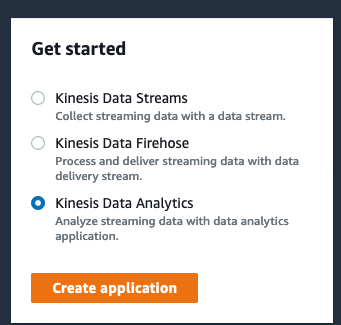
3. On the Kinesis Data Analytics - Create application page:
    * Select Legacy SQL as the runtime and click on Create Application.
            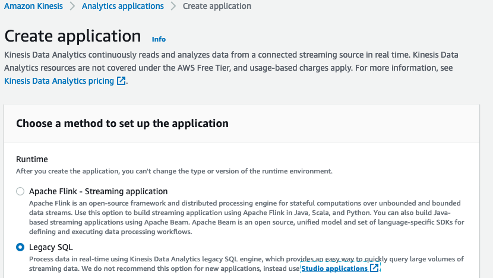
    * For application name, type ```anomaly-detection-application```.
    * Type a description for the analytics application and click on Create Application
    * Once created, Open analytics application and expand the 'Steps to configure application' and click on 'Configure source stream'.
            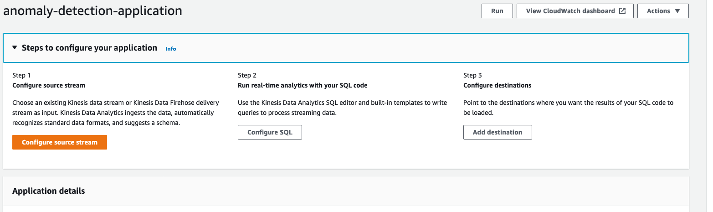
    * Select the Source as Kinesis Data Firehose delivery stream and select the Delivery Stream created by the CloudFormation template: **{stack-name}-FirehoseDeliveryStream-{random string}**
    * Select 'Off' for the Record preprocessing with AWS Lambda for this lab.
    * Select 'Choose from IAM roles that Kinesis Data Analytics can assume' and associate the following service role: **{stack-name}-CSEKinesisAnalyticsRole-{random string}**
    * **Do not** Click on Discover Schema at this point.
        Open the KDG tool, and click on 'Send Data' for the 'Schema Discovery Payload' template. This will send the sample data to the Kinesis Data Firehose delivery stream.
        Make sure to login to the tool. 
            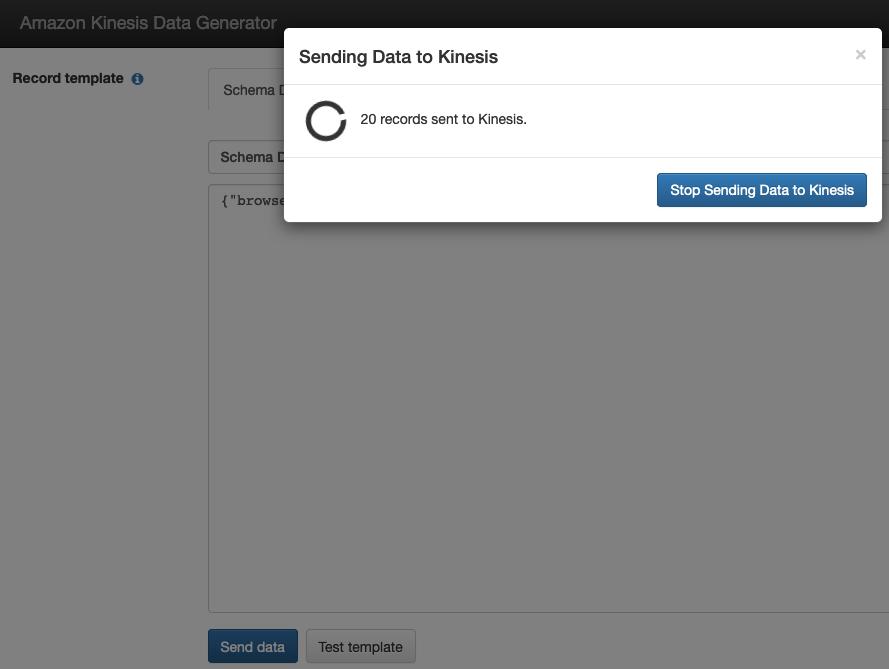
    * Now go back to the AWS console and click on Discover Schema to display the schema and the formatted data received. 
            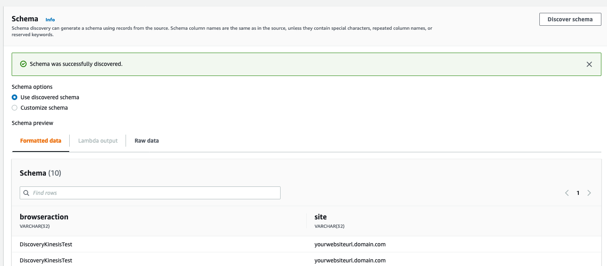
    * Leave the 'Use discovered schema' option selected for 'Schema options' and click on Save changes. The source stream should show as below:
            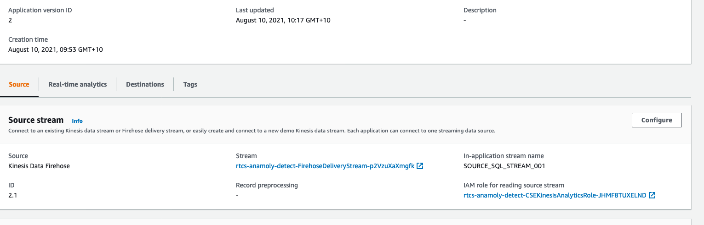
    * Now navigate to the 'Real-time analytics' tab and click on Configure.
    * Replace the sql with the contents of the following file:  and click on 'Save and run application'. This should take a minute to run.
            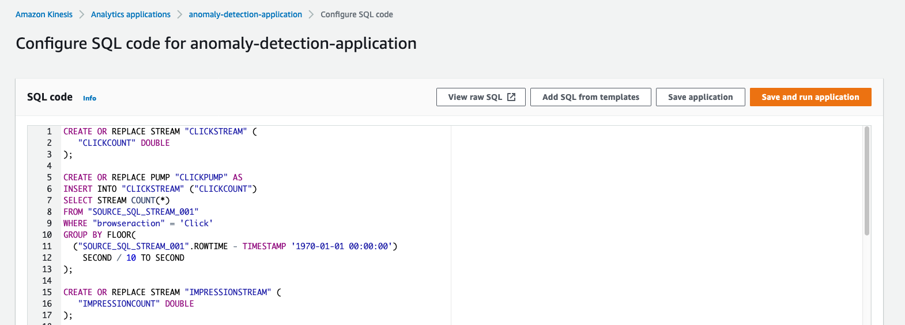
    
    * On the same page scroll down to view the Input and Output sub tab. The Input sub tab will list the source stream and the Output sub-tab will display the output streams created by the SQL run before.
            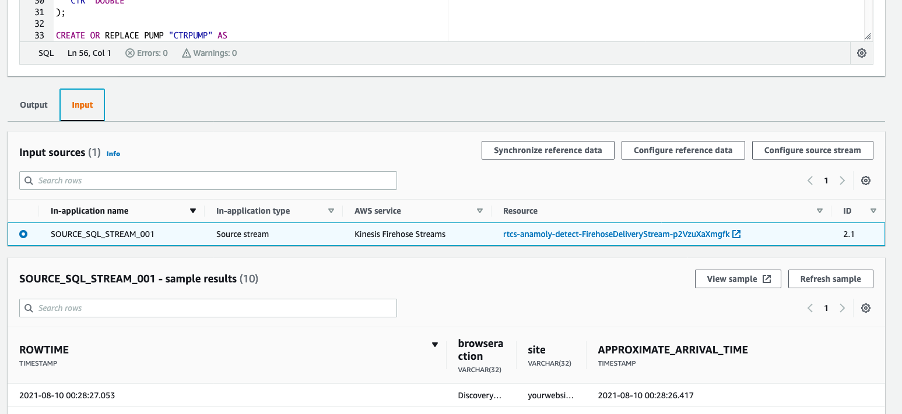

At this point you have created:
* Kinesis Data Analytics application schema for click stream and impression stream data using the 'Schema Discovery Payload' sent from the KDG tool
* You have also created an output stream schema, using . The schema will in real-time convert the input stream to the output stream.
* The DESTINATION_SQL_STREAM uses the RANDOM_CUT_FOREST function to detect anomalies within the input data stream. You can read more about the function .

## Send in click, impression stream data and detect anomalies
1. To send in the click and impression data we will need to login to the KDG tool in 5 tabs and Send data to the Kinesis data stream firehose based on the table below
    |**Tab**|**Payload**|**Records per Second**|
    | --- | --- | --- |
    |1|Impression|1|
    |2|Click|1|
    |3|Click|1|
    |4|Click|1|
    |5|Click|1|
2. With the KDG tool sending data to Kinesis, the input data can be viewed in the AWS Console.
            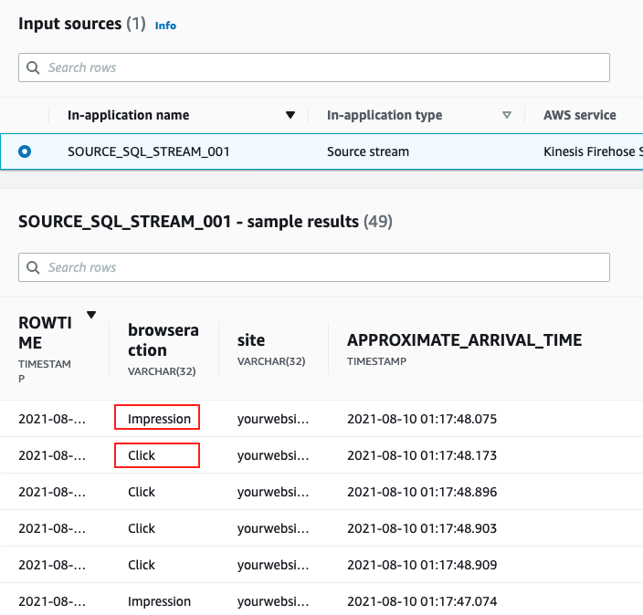
4. Similarly the data can be viewed in the output data stream. E.g. IMPRESSIONSTREAM, CLICKSTREAM. DESTINATION_SQL_STREAM. 
            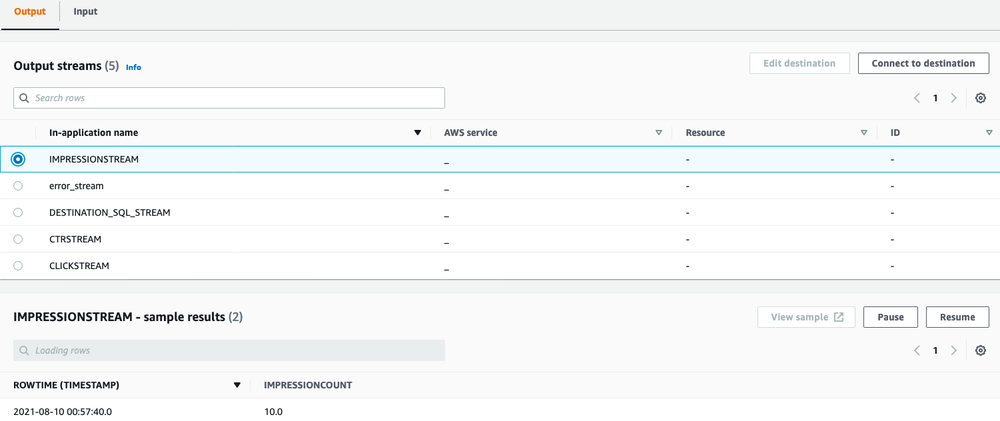
            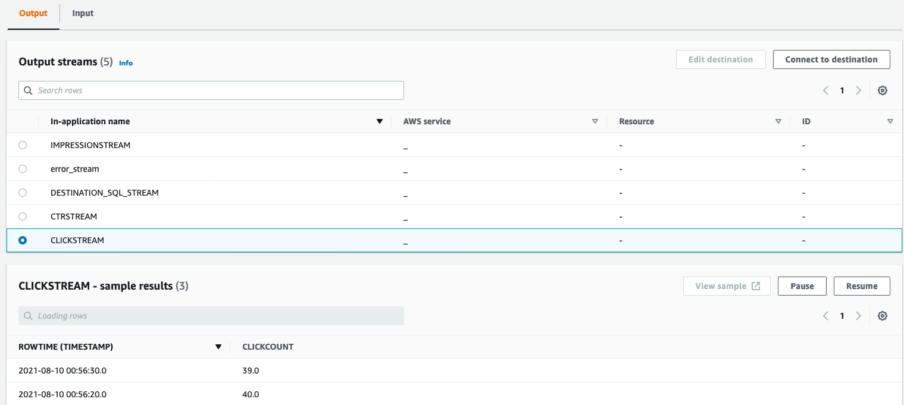
            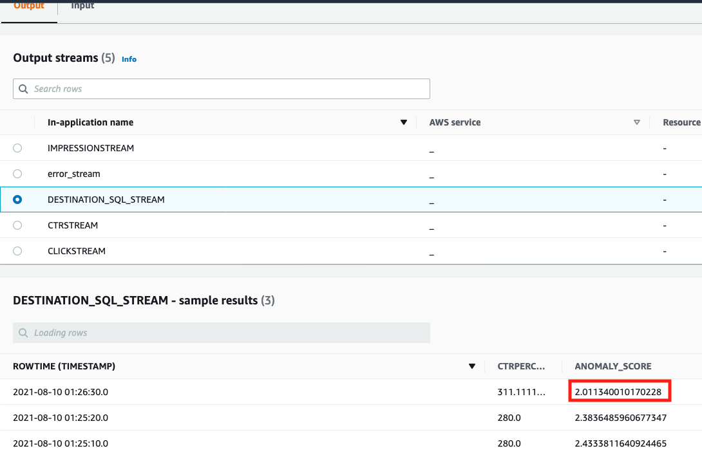
5. Stop the KDG tool stream before the next step.

## Sending detected anomalies
The DESTINATION_SQL_STREAM output stream contains records where anomalies have been found and need to be reported. In this section we will configure a new destination (a lambda function) to direct the anomalies to an SNS Topic.
1. In the output subtab click on 'Connect to destination'.
            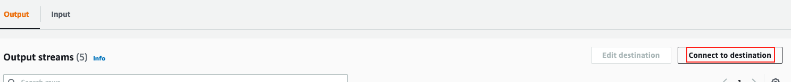
2. Click on Add Destinations on the Destinations tab.
            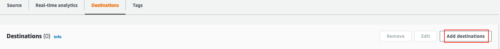
3. Select 'AWS Lambda function' as a destination and browse for the Lamdba function,**CSEBeconAnomalyResponse**, created by the CloudFormation template with version set as $LATEST.
4. For Access Permissions, select 'Choose from IAM roles that Kinesis Data Analytics can assume' and select  **{stack-name}-CSEKinesisAnalyticsRole-{random-string}** as the service role.
            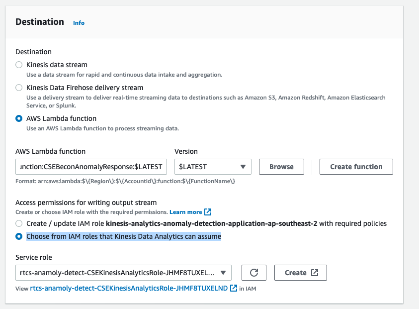
5. For the In-application stream name, select 'Choose an existing in-application stream' and select 'DESTINATION_SQL_STREAM' and leave the Ouput format as JSON. Click on Save Changes.
            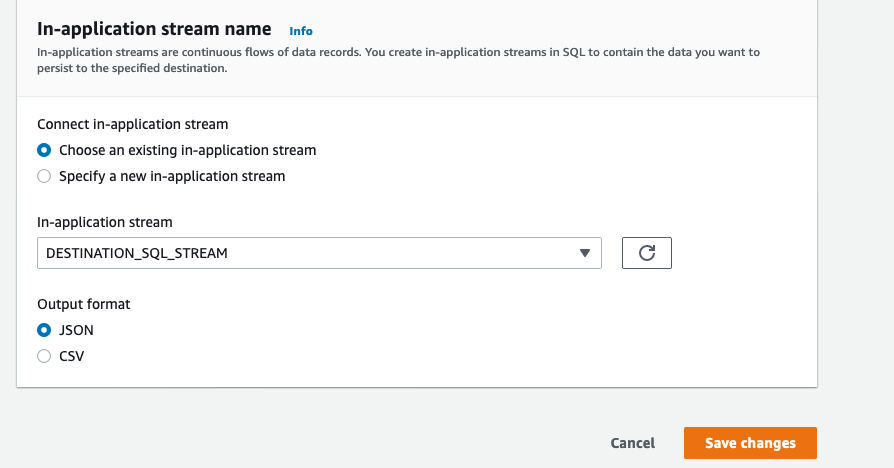
            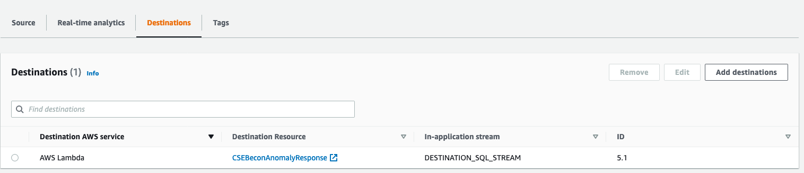

    


