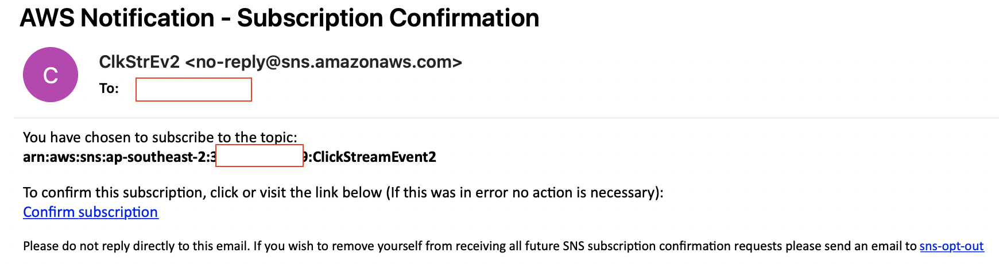
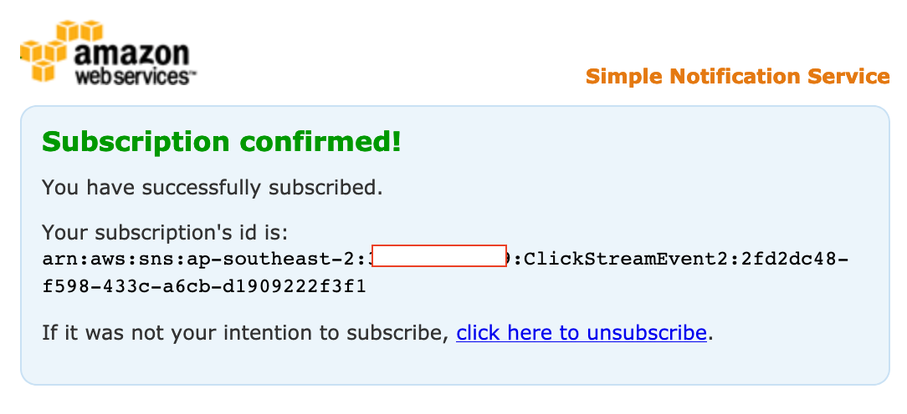

# Real-Time Clickstream Anomaly Detection Kinesis Analytics
This lab is provided as part of [AWS Innovate Data Edition](https://aws.amazon.com/events/aws-innovate/data/), click here to explore the full list of hands-on labs.

ℹ️ You will run this lab in your own AWS account and running this lab will incur some costs. Please follow directions at the end of the lab to remove resources to avoid future costs.

## Table of Contents  
[Overview](#overview)  
[Architecture](#architecture)  
[Pre-Requisites](#pre-Requisites)  
[Setup an Amazon Kinesis Data Generator](#setup-an-amazon-kinesis-data-generator)  
[Login to KDG](#login-to-kdg)  


## Overview
This lab helps you to use Kinesis Data Analytics to perform Real-Time Clickstream Anomaly Detection. Amazon Kinesis Data Analytics is a managed service that makes it easy to analyse web log traffic that drive business decisions in real-time.

The lab uses the Kinesis Data Generator (KDG) tool to generate data and sends it to Amazon Kinesis. The tool provides a user-friendly UI that runs directly in your browser. 

**Duration** - Approximately 1 hour


With the KDG, you can do the following tasks:

        Create templates that represent records for your specific use cases
        Populate the templates with fixed data or random data
        Save the templates for future use
        Continuously send thousands of records per second to your Amazon Kinesis stream or Firehose delivery stream

## Architecture


## Pre-Requisites

The below cloudformation template deploys the lab pre-requisites in your AWS account. 
Note:
* The stack selects the Asia Pacific(Sydney) for deployment, please alter the region as required.
* Acknowledge that the CloudFormation might create IAM resources
* Deploy stack

    | Region | CloudFormation |
    | --- | --- |
    | Asia Pacific(Sydney) | [](https://console.aws.amazon.com/cloudformation/home?region=ap-southeast-2#/stacks/new?stackName=rtcs-anamoly-detect&templateURL=https://s3.amazonaws.com/aws-dataengineering-day.workshop.aws/Kinesis_PreLab.yaml)|

* The CloudFormation stack takes the following parameters as input:
    |Parameter|Description|
    | --- | --- |
    |Username|User name for the KDG tool. This will be a user in the Amazon Cognito|
    |Password|Password for the user in Amazon Cognito|
    |Email|The email address to send anomaly events|
    |SMS|The mobile phone number to send anomaly events|

* While the stack runs, watch out for an email as below.

* Confirm the subscription to receive the below message.

* Once the stack is deployed, click the outputs tab to view more information.
    * **KinesisDataGeneratorUrl** - This value is the Kinesis Data Generator (KDG) URL.
    * **RawBucketName** - Store raw data coming from KDG.
    * **ProcessedBucketName** - Store transformed data 
    

## Setup an Amazon Kinesis Data Generator
On the Outputs tab, notice the Kinesis Data Generator URL. Navigate to this URL to login into the Amazon Kinesis Data Generator (Amazon KDG).

The KDG simplifies the task of generating data and sending it to Amazon Kinesis. The tool provides a user-friendly UI that runs directly in your browser. With the KDG, you can do the following tasks:
    * Create templates that represent records for your specific use cases
    * Populate the templates with fixed data or random data
    * Save the templates for future use
    * Continuously send thousands of records per second to your Amazon Kinesis stream or Firehose delivery stream

### Login to KDG
1. Click on the KinesisDataGeneratorUrl on the Outputs tab on the stack.
2. Sign in using the username and password you enetered in the CloudFormation console.

3. After you sign in, you should see the KDG console. You need to set up some templates to mimic the clickstream web payload.
4. Create the following templates in the KDG console. But do not click on the 'Send Data' yet:
   |**Records per Second**|**Template Name**|**Payload**|**Description**|
   | --- | --- | --- | --- |
   | 1 |```Schema Discovery Payload``` | ```  {"browseraction":"DiscoveryKinesisTest", "site": "yourwebsiteurl.domain.com"}``` |Payload used for schema discovery|
   | 1 |```Click Payload``` | ```  {"browseraction":"Click", "site": "yourwebsiteurl.domain.com"} ``` |Payload used for clickstream data|
   | 1 |```Impression Payload``` | ```  {"browseraction":"Impression", "site": "yourwebsiteurl.domain.com"}``` |Payload used for impression stream data|


 
## Setup an Analytics Pipeline Application
1.  